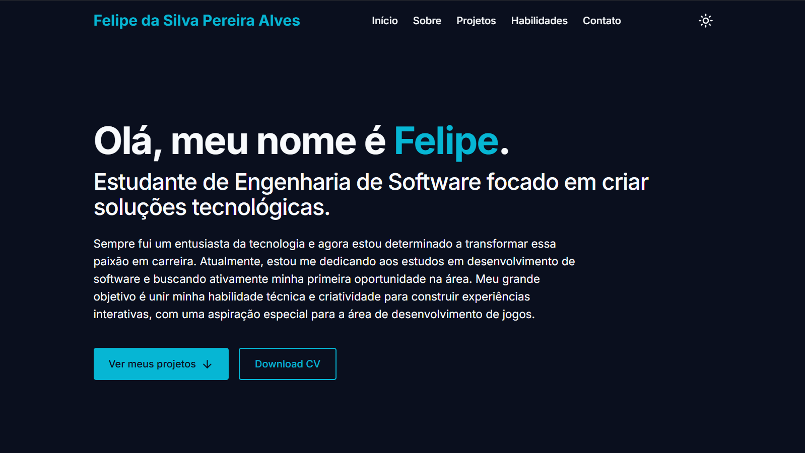

# Portfólio Pessoal - Felipe Alves

[](https://felipealves-portfolio.vercel.app/)

Acesse a versão live em: **[felipealves-portfolio.vercel.app](https://felipealves-portfolio.vercel.app/)**

---

## 🎯 Sobre o Projeto

Este é o meu portfólio pessoal, desenvolvido para centralizar meus projetos, habilidades e informações de contato. É o "hub" principal onde demonstro meu trabalho e minha jornada como desenvolvedor de software.

Este projeto foi construído do zero como uma aplicação **Next.js** e hospedado na **Vercel**.

## ✨ Visual




## 🚀 Tecnologias Utilizadas

Este projeto foi construído utilizando tecnologias modernas de frontend:

* **[Next.js](https://nextjs.org/)**: Framework React para renderização (SSR/SSG).
* **[React](https://react.dev/)**: Biblioteca principal para a UI.
* **[TypeScript](https://www.typescriptlang.org/)**: Para tipagem estática e um código mais robusto.
* **[Tailwind CSS](https://tailwindcss.com/)**: Para estilização rápida e utilitária.
* **[Vercel](https://vercel.com/)**: Para deploy e hospedagem contínua (CI/CD).

## 🌟 Features

* **Design Responsivo**: Totalmente adaptável para desktops, tablets e celulares.
* **Seção de Projetos**: Um grid dinâmico que exibe meus trabalhos, carregados a partir de um array de dados estruturado.
* **Links de Contato**: Acesso fácil ao meu GitHub e outras redes profissionais.

## 🏁 Rodando Localmente

Para rodar este projeto no seu ambiente:

1.  Clone o repositório:
    ```bash
    git clone [https://github.com/fdasilvapa/Meu-portfolio.git](https://github.com/fdasilvapa/Meu-portfolio.git)
    ```
2.  Entre na pasta e instale as dependências:
    ```bash
    cd Meu-portfolio
    npm install
    ```
3.  Rode o servidor de desenvolvimento:
    ```bash
    npm run dev
    ```
4.  Abra `http://localhost:3000` no seu navegador.

## 👨‍💻 Contato

Felipe da Silva - [Github](https://github.com/fdasilvapa)